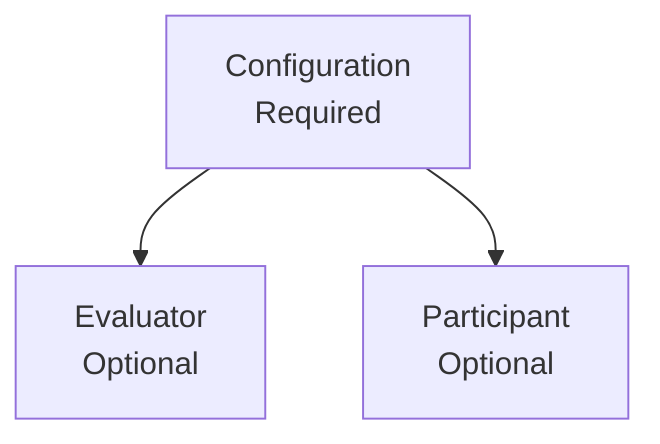

The Transcribe page is where you submit audio or video content for processing. Select a **Configuration** (required) that defines how the content will be handled, optionally attach an **Evaluator** to score the transcript against quality criteria, optionally link a **Participant** to attribute the result to a specific person, then provide the media as a local file upload or a public URL.

---

## Transcription parameters

The three parameters are arranged as a tree to communicate their relationship:



### Configuration *(required)*

A searchable dropdown listing all your configurations. Selecting one associates all of its settings — language, summary, extraction fields, and webhooks — with this transcription job.

<Info>
  Don't have a configuration yet? [Create one first →](/sandbox/configurations)
</Info>

### Evaluator *(optional)*

Opens a selector modal listing your evaluators with name, ID, and criteria count. Selecting one causes the AI to score the transcript against that evaluator's criteria once processing completes.

### Participant *(optional)*

Opens a selector modal listing your participants with name, ID, and department (if set). Selecting one links the transcription result to that person for analytics and performance reporting.

<Tip>
  Selecting both an **Evaluator** and a **Participant** gives you quality scores attributed to a specific person — the foundation of individual performance tracking.
</Tip>

---

## Upload method

A toggle below the parameter selectors switches between two modes:

| Mode | Use when |
|---|---|
| **Local File(s)** | You have files on your device to upload |
| **Public URL** | The file is already hosted at a publicly accessible URL |

---

## Local File(s) mode

### Drop zone

Drag & drop files onto the zone or click anywhere on it to open a file picker.

**Supported formats:** `aac` · `aiff` · `amr` · `asf` · `flac` · `mp3` · `ogg` · `wav` · `webm` · `m4a` · `mp4`

For file size and duration limits, see [Rate Limits & Quotas](/platform/rate-limits).

Files with unsupported formats are automatically filtered out and a warning shows how many were rejected. You can add up to **25 files** per submission.

### Processing Queue

The queue appears as soon as files are added. Each item shows:

| Element | Description |
|---|---|
| **Status icon** | Queued · Uploading · Success · Error |
| **File name & size** | Truncated filename and size in MB |
| **Name** | Optional free-text label for the transcription (e.g. `Q3 team meeting`) |
| **Status pill** | **Queued** · **Uploading...** · **Started** · **Error** |
| **Transcription ID** | Shown after success — monospace with copy button and link to the detail view |

<Note>
  Files are processed **sequentially** with a short pause between each. This is intentional and prevents API rate issues — parallel uploads are not supported.
</Note>

<Note>
  Re-submitting a batch only retries files in **Queued** or **Error** state. Files that already completed successfully are not re-processed.
</Note>

---

## Public URL mode

| Field | Required | Notes |
|---|---|---|
| **File URL** | Yes | Direct public link to the audio/video file (e.g. `https://my-server.com/recording.mp3`) |
| **Transcription Name** | No | Optional human-readable label |

After successful submission, a result card appears showing the transcription ID with a copy button and a link to the detail view.

<Warning>
  The URL must be **publicly accessible** with no authentication required. The file must be reachable at the time the pipeline processes it — the download has a **60-second timeout**. Use a stable, fast URL.
</Warning>

---

## After submission

Once a batch finishes or a URL submission succeeds, the submit button changes to **Process More Files**. Clicking it clears the file queue (or URL fields) so you can start a new batch — your **Configuration, Evaluator, and Participant selections are retained**.

---

## Best practices

<AccordionGroup>
  <Accordion title="Audio quality tips" icon="volume">
    Better audio quality produces more accurate transcriptions.

    **Recommended:**
    - Minimize background noise
    - Use quality recording equipment
    - Keep audio levels consistent — not too quiet, not too loud
    - 16 kHz+ sample rate (higher is better)
    - Mono or stereo both work; mono files are smaller

    **Avoid:**
    - Heavy background music or ambient noise
    - Multiple speakers talking over each other
    - Very low bitrate compression
    - Heavily processed audio with effects
  </Accordion>

  <Accordion title="Public URL checklist" icon="link">
    Before submitting a URL, verify that:

    - The URL opens directly in an **incognito browser window** (no login required)
    - It is a **direct link to the file**, not a media player page
    - The file format is one of the supported extensions
    - The URL uses **HTTPS** (HTTP also accepted)
    - The server can respond within **60 seconds**

    You can test the URL quickly with:
    ```bash
    curl -I https://your-url.com/audio.mp3
    ```
    Expect a `200 OK` response with `Content-Type: audio/...`.
  </Accordion>
</AccordionGroup>

---

<CardGroup cols={3}>
  <Card title="Configurations" icon="gear" href="/sandbox/configurations">
    Set up your processing templates
  </Card>
  <Card title="Evaluators" icon="clipboard-check" href="/sandbox/evaluators">
    Create quality scoring rubrics
  </Card>
  <Card title="Participants" icon="user" href="/sandbox/participants">
    Manage agent profiles
  </Card>
</CardGroup>
