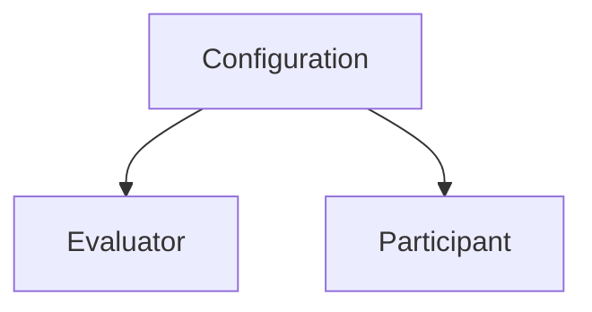

This section covers two connected views: the **Transcriptions list** where you manage all your jobs, and the **Detail view** where you inspect the full results of a single transcription — transcript, AI summary, quality audit, and extracted fields.

---

## Part 1 — Transcriptions list

### Header

| Button | What it does |
|---|---|
| **Export** | Downloads the currently filtered list as a CSV file |
| **Filters** | Toggles the advanced filter panel — a blue badge shows how many filters are active |
| **Refresh** | Reloads the list from the API |
| **New Transcription** | Opens the [Transcribe](/sandbox/transcribe) page |

### Group tabs

A tab bar below the header lets you filter by group with a single click:

| Tab | Color |
|---|---|
| **All** | Slate |
| **No group** | Grey |
| **Pending Review** | Amber |
| **Under Review** | Blue |
| **Archived** | Purple |

Each tab shows a count badge reflecting how many transcriptions are in that group. See [Groups & workflow](#groups--workflow) for guidance on using groups to organize your review process.

### Filters panel

Click **Filters** to slide open the advanced panel.

| Filter | Options |
|---|---|
| **Search** | Free-text match on ID, name, or configuration tag. Autocomplete shows up to 5 suggestions after 2+ characters. |
| **Status** | All · Completed · In Progress · Failed |
| **Configuration** | Searchable selector |
| **Participant** | Limited to participants present in loaded results |
| **Evaluator** | Limited to evaluators present in loaded results |
| **Critical Failures Only** | Shows only transcriptions where a Strict criterion failed |
| **Date range** | From / To — quick presets: Today · This week · This month · This quarter |

<Note>
  Active filters are synced to the URL query string. Copy the browser URL to share or bookmark an exact filtered view.
</Note>

### Grid and list view

Toggle between a card grid and a resizable table. Both views show:

- **Status badge** — Completed (green) · In Progress (blue, spinning) · Failed (red)
- **Quality score** — `X.X / 100`, green when ≥ 50, red when < 50. A red octagon icon appears if a Critical Failure occurred.
- **Group badge** — with an inline pencil button to change the group without opening the detail view
- **Configuration tag** — clickable, opens configuration detail in a new tab
- **Evaluator tag** — clickable (if linked), opens evaluator detail in a new tab
- **Participant tag** — shown if a participant was linked

The **table layout** has resizable columns — drag the thin handle at the right edge of any column header to resize it.

### Bulk actions

Hover over any card or row to reveal a checkbox. Selecting at least one item shows a blue action bar:

| Action | What it does |
|---|---|
| **Change group** | Applies a new group to all selected transcriptions at once |
| **Delete** | Deletes all selected transcriptions (confirmation required) |

The table header includes a **select all** checkbox for the current page.

### Export CSV

The **Export** button downloads the currently filtered list as `transcriptions_YYYY-MM-DD.csv`.

CSV columns: `ID` · `Name` · `Configuration` · `Status` · `Group` · `Duration (s)` · `Date`

---

## Part 2 — Transcription detail

Click any transcription to open the detail view. You can also load any transcription directly by entering its ID in the search bar at the top of the page.

### Header

| Element | Behavior |
|---|---|
| **Transcription name** | Primary title — shows the ID if no name was given |
| **Copy ID** | Copies the transcription ID to clipboard |
| **Export PDF** | Downloads a quality report. Only shown when a Quality Audit is present. |
| **Delete** (trash) | Opens the delete confirmation modal |

### Metadata

A two-column grid showing: Status · Group (editable via pencil button) · Duration · Creation Date · Language detected · Number of speakers. The Configuration tag is shown below with a link that opens its detail in a new tab.

The **Applied Modules** tree mirrors the Transcribe form and shows which Configuration, Evaluator, and Participant were applied to this job. Each applied node is clickable. Nodes that were not used show "Not applied."

### AI Summary

A collapsible card with the AI-generated summary rendered as formatted markdown (headings, bullets, bold text). A **Copy summary** button copies the raw text.

Hidden if the configuration did not have summary enabled.

### Quality Audit

A collapsible card. Only shown when an evaluator was applied and the audit has completed.

#### Score and KPIs

A circle gauge displays the overall score (0–100). Ring color reflects performance:

| Score | Color |
|---|---|
| ≥ 80 | Green |
| 50–79 | Amber |
| < 50 | Red |

Three chips summarize the audit results:

| Chip | Meaning |
|---|---|
| **Passed** | Number of criteria scored as a pass |
| **Critical** | Strict criteria that failed — triggers automatic overall failure |
| **Failures** | Weighted (non-strict) criteria that failed |

#### Criteria Breakdown

All criteria are listed as expandable rows showing: sequential number, criterion name, type badge (`Yes/No` · `Scale` · `Critical`), pass/fail icon, and weight %.

**Focus Mode** toggle — when enabled, the list shows only **failed** criteria.

<Tip>
  Use Focus Mode to zero in on improvement areas without scrolling through all passing criteria.
</Tip>

Expand any criterion to see:

| Section | Content |
|---|---|
| **Reasoning** | The AI's explanation of why this criterion passed or failed |
| **Quote** | The exact phrase from the transcript the AI cited as evidence |
| **Improvement Opportunity** | Specific coaching advice for the evaluated participant |

<Tip>
  The **Quote** section has a **Search in transcription** button. Clicking it scrolls the page down to the matching conversation segment and highlights it with a ring. A floating **Back** button appears at the bottom-right corner to return you to the audit section.
</Tip>

### Extracted Fields

A collapsible card showing all structured data the AI extracted. Only shown if the configuration had extraction fields enabled and values were found.

Each field shows its name and value — arrays as pill tags, booleans as **Yes** / **No** badges, text as plain string — with a per-field copy button.

### Conversation

A collapsible card showing the full transcript as conversation segments. Only shown if the transcription produced speaker-diarized output.

- **Search** — type to filter visible segments and highlight matching terms in yellow
- Each segment shows: a colored speaker avatar (consistent per speaker), speaker label, timestamp range (`MM:SS – MM:SS`), and transcript text

Clicking **Search in transcription** from a Quality Audit criterion scrolls directly to the relevant segment and highlights it.

### PDF Export

The **Export PDF** button (header) downloads `Report_[name]_[date].pdf` containing:

- Metadata: file name · participant · evaluator · evaluation date
- Score summary: overall score · passed / critical / failed counts
- Executive feedback
- Criteria breakdown table: Criteria · Status · Points · Feedback · Quote · Advice

<Note>
  **Export PDF** is only available when a Quality Audit is present. Transcriptions without an evaluator do not have this option.
</Note>

### What can and cannot be changed

<Note>
  Transcription results are **read-only** after processing. Only the **name**, **group**, and **deletion** are mutable from these views.
</Note>

<Warning>
  Deleting a transcription is **permanent** and removes all associated results — AI summary, extracted fields, audit data, and conversation segments.
</Warning>

---

## Groups & workflow

<AccordionGroup>
  <Accordion title="Using groups to organize your review process" icon="diagram-project">
    Groups give your team a shared signal for where each transcription stands in the review workflow.

    | Group | Suggested use |
    |---|---|
    | **No group** | Default — newly processed transcriptions that haven't been triaged yet |
    | **Pending Review** | Flagged for manual inspection — quality check needed, score seems off, or a Strict criterion failed |
    | **Under Review** | Actively being reviewed by a team member |
    | **Archived** | Review complete — data extracted, no further action needed |

    **Benefits:** clear visibility of work status, easy handoffs between team members, and a reliable way to track progress over time.
  </Accordion>

  <Accordion title="Regular cleanup" icon="broom">
    A clean list makes it easier to find what matters.

    **Suggested cadence:**
    - **Weekly** — archive completed work
    - **Monthly** — delete test transcriptions and resolved failures
    - **Quarterly** — export important batches as CSV for backup

    **Good candidates for deletion:** test uploads, duplicate submissions, failed jobs after root cause is identified, and outdated data no longer needed for reporting.
  </Accordion>
</AccordionGroup>

---

<CardGroup cols={2}>
  <Card title="Transcribe" icon="microphone" href="/sandbox/transcribe">
    Submit a new transcription
  </Card>
  <Card title="Transcription" icon="file-lines" href="/core/transcription">
    Full data model reference
  </Card>
</CardGroup>
